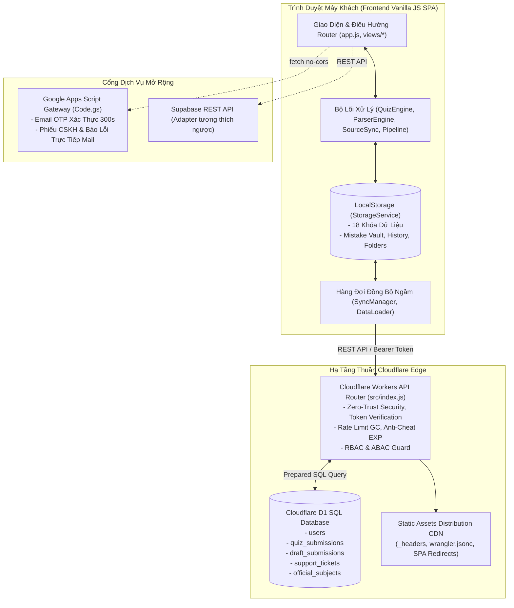
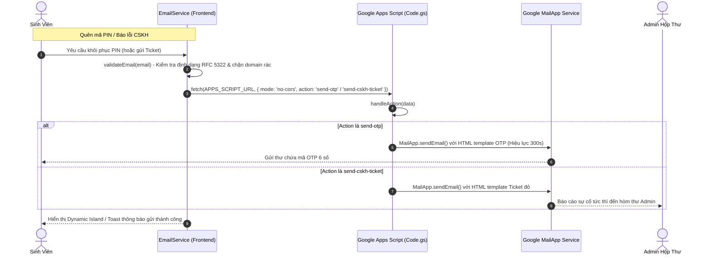
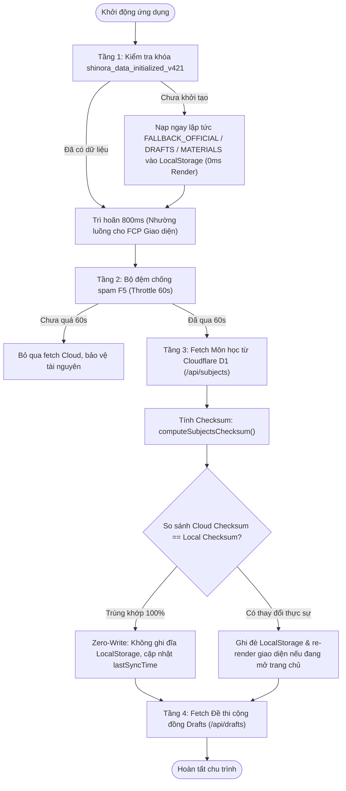
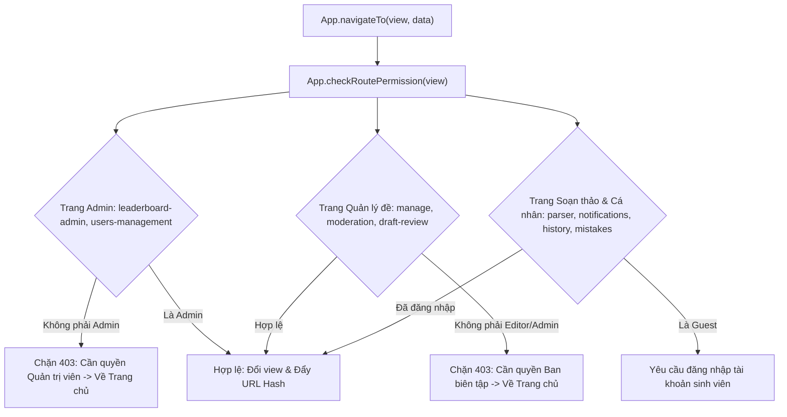

# 📖 SHINORA QUIZMASTER — BÁO CÁO CHUYÊN SÂU KIẾN TRÚC, FUNCTIONS, CLOUD & LOCAL STORAGE
> **Phiên bản hệ thống:** `v4.2.1-beta.a1f8c3` (100% Pure Cloudflare Architecture with Native D1 SQL Database)  
> **Trang Web Trực Tuyến:** [https://shinora-quizmaster.btai37999.workers.dev](https://shinora-quizmaster.btai37999.workers.dev)  
> **Tác giả & Nhà phát triển chính:** **Bùi Văn Khang (Shina Sanora)** — MSSV: `0024418475`  
> **Tài liệu phục vụ:** Báo cáo kỹ thuật chi tiết, kiểm toán bảo mật, bảo trì và mở rộng hệ thống.

---

## 📑 MỤC LỤC TỔNG QUAN

1. [Tổng Quan Kiến Trúc Hệ Thống (Architectural Overview)](#1-tổng-quan-kiến-trúc-hệ-thống)
2. [Chi Tiết Các Truy Vấn Đám Mây & Giao Tiếp Dữ Liệu (Cloud API, Queries & Exchange)](#2-chi-tiết-các-truy-vấn-đám-mây--giao-tiếp-dữ-liệu)
   - [2.1. Cloudflare Workers API Core (`src/index.js`)](#21-cloudflare-workers-api-core-srcindexjs)
   - [2.2. Cơ Sở Dữ Liệu Quan Hệ SQL Phân Tán Cloudflare D1 (`schema.sql`)](#22-cơ-sở-dữ-liệu-quan-hệ-sql-phân-tán-cloudflare-d1-schemasql)
   - [2.3. Trình Điều Phối Client Đám Mây (`cloudflare-client.js`)](#23-trình-điều-phối-client-đám-mây-cloudflare-clientjs)
   - [2.4. Cổng Mail & CSKH Google Apps Script Serverless Gateway (`Code.gs` & `email.js`)](#24-cổng-mail--cskh-google-apps-script-serverless-gateway)
   - [2.5. Adapter Tương Thích Ngược Supabase Cloud (`supabase-client.js`)](#25-adapter-tương-thích-ngược-supabase-cloud-supabase-clientjs)
3. [Chi Tiết Lưu Trữ Cục Bộ & Xử Lý Ngoại Tuyến (Local Storage & Offline-First)](#3-chi-tiết-lưu-trữ-cục-bộ--xử-lý-ngoại-tuyến)
   - [3.1. Hệ Thống Khóa Lưu Trữ Cục Bộ (`StorageService.KEYS`)](#31-hệ-thống-khóa-lưu-trữ-cục-bộ-storageservicekeys)
   - [3.2. Cơ Chế Đồng Bộ Ngầm Tuần Tự (`SyncManager`)](#32-cơ-chế-đồng-bộ-ngầm-tuần-tự-syncmanager)
   - [3.3. Tải Dữ Liệu Khởi Tạo 0ms, Checksum & Zero-Write (`DataLoader`)](#33-tải-dữ-liệu-khởi-tạo-0ms-checksum--zero-write-dataloader)
   - [3.4. Định Danh Thiết Bị & Kiểm Soát Khách Vãng Lai 100% Offline Guard](#34-định-danh-thiết-bị--kiểm-soát-khách-vãng-lai-100-offline-guard)
4. [Chi Tiết Các Hàm & Bộ Lõi Chức Năng (Core Functions & Engines)](#4-chi-tiết-các-hàm--bộ-lõi-chức-năng)
   - [4.1. Bộ Lõi Khảo Thí (`QuizEngine`)](#41-bộ-lõi-khảo-thí-quizengine)
   - [4.2. Bộ Lõi Bóc Tách Đề Thi FSM Modular (`ParserEngine`)](#42-bộ-lõi-bóc-tách-đề-thi-fsm-modular-parserengine)
   - [4.3. Đồng Bộ Tọa Độ 2 Chiều Editor <-> Preview (`SourceSync`)](#43-đồng-bộ-tọa-độ-2-chiều-editor---preview-sourcesync)
   - [4.4. Pipeline Bóc Tách File Đa Tầng 6-Stages (`FilePipeline`)](#44-pipeline-bóc-tách-file-đa-tầng-6-stages-filepipeline)
   - [4.5. Gamification, Điểm EXP/CP & Bảng Xếp Hạng Mùa Giải](#45-gamification-điểm-expcp--bảng-xếp-hạng-mùa-giải)
   - [4.6. Phân Quyền RBAC/ABAC & Điều Hướng Router SPA](#46-phân-quyền-rbacabac--điều-hướng-router-spa)
   - [4.7. Các Tiện Ích Trợ Năng (Study Dock, Dynamic Island, AudioFX)](#47-các-tiện-ích-trợ-năng-study-dock-dynamic-island-audiofx)
5. [Ma Trận Bản Đồ Hàm & API Toàn Dự Án (Function & API Matrix Map)](#5-ma-trận-bản-đồ-hàm--api-toàn-dự-án)

---

## 1. TỔNG QUAN KIẾN TRÚC HỆ THỐNG

Dự án **Shinora QuizMaster** được thiết kế theo mô hình **Pure Cloudflare Architecture** kết hợp với kiến trúc **Local-First & Offline-Ready**. 



### Đặc điểm thiết kế cốt lõi:
1. **100% Zero Third-Party Dependency Core:** Sử dụng Vanilla JS tiêu chuẩn (ES6+), không phụ thuộc framework cồng kềnh, tải trang tức thì ($0\text{ms}$ Initial Render).
2. **Local-First Resilience:** Hệ thống ưu tiên đọc và ghi tại `LocalStorage`. Mọi thao tác thi cử, làm bài, đọc tài liệu đều diễn ra trơn tru dù mất kết nối mạng.
3. **Stale-While-Revalidate & Smart Throttling:** Đồng bộ ngầm với Cloud sau khi khởi động app mà không chặn luồng giao diện người dùng, sử dụng **Checksum Hashing** để ngăn chặn thao tác ghi đĩa dư thừa.

---

## 2. CHI TIẾT CÁC TRUY VẤN ĐÁM MÂY & GIAO TIẾP DỮ LIỆU

### 2.1. Cloudflare Workers API Core (`src/index.js`)

Backend API chạy trên Cloudflare Workers Edge, đảm nhiệm toàn bộ việc xác thực, phân quyền, phòng thủ DDoS, chống gian lận và thực thi SQL xuống Cloudflare D1.

#### A. Các hàm bảo mật nền tảng:
- `hashPinCode(pin, customSalt)`: Băm mã PIN hoặc payload bằng chuẩn mật mã học `crypto.subtle.digest("SHA-256")` kết hợp muối `PIN_SALT = "shinora_quiz_secure_salt_v3"`.
- `createSessionToken(studentId, role, secretKey)`: Sinh JWT-like token gọn nhẹ dạng `base64(payload).sha256_signature` với hạn dùng 7 ngày.
- `verifyToken(authHeader, env)`: Giải mã và kiểm tra chữ ký token qua `env.ADMIN_TOKEN_SECRET`. Nếu hợp lệ trả về `{ sub, role, iat, exp }`.
- `checkRateLimit(ip, endpoint, limit, windowMs)`: Bộ đếm giới hạn tốc độ yêu cầu nội tại kèm cơ chế **Garbage Collection (GC)** tự dọn rác khi bộ nhớ vượt quá 500 bản ghi để chống rò rỉ RAM Worker.
- `sanitizeUserResponse(u, isAdmin)`: Chuẩn hóa dữ liệu user (Data Minimization), bảo vệ tuyệt đối không bao giờ làm lộ `pin_code` ra ngoài; ẩn email/phone đối với client thông thường.

#### B. Bảng chi tiết toàn bộ Endpoint & Truy vấn SQL D1:

| Method | Endpoint | Quyền hạn | Mục đích nghiệp vụ | Truy vấn Cloudflare D1 SQL thực thi |
| :--- | :--- | :--- | :--- | :--- |
| `GET` | `/api/health` | Public | Kiểm tra trạng thái máy chủ Edge | Không truy vấn |
| `POST` | `/api/auth/login` | Public (Rate limit 5/min) | Đăng nhập MSSV + PIN, cấp Bearer Token | `SELECT * FROM users WHERE student_id = ?`<br/>`UPDATE users SET pin_code = ? WHERE id = ?` (auto-upgrade hash) |
| `GET` | `/api/users` | Admin only | Lấy toàn bộ danh sách sinh viên quản trị | `SELECT * FROM users ORDER BY created_at DESC` |
| `GET` | `/api/users/me` | Logged in | Lấy thông tin hồ sơ cá nhân | `SELECT * FROM users WHERE student_id = ?` |
| `POST` | `/api/users/presence` | Logged in | Cập nhật trạng thái online/afk/ngữ cảnh | `UPDATE users SET presence_status = ?, presence_context = ?, last_seen_at = CURRENT_TIMESTAMP WHERE student_id = ?` |
| `POST` | `/api/users/register` | Public (Rate limit 5/min) | Đăng ký tài khoản sinh viên mới (`pending_approval`) | `SELECT id FROM users WHERE student_id = ?`<br/>`INSERT INTO users (id, student_id, class_name, full_name, email, phone, department, role, pin_code, avatar, total_exp, season_exp, ...) VALUES (...)` |
| `POST` | `/api/users/update` | RBAC & ABAC | Sửa thông tin tài khoản / Phê duyệt | Chống IDOR: Chỉ sửa chính mình trừ khi là Admin.<br/>`UPDATE users SET [dynamic fields], updated_at = CURRENT_TIMESTAMP WHERE id = ?` |
| `POST` | `/api/quiz/submit` | Logged in | Nộp bài thi, chống gian lận (Anti-cheat trần 100 EXP) | `INSERT INTO quiz_submissions (id, user_id, student_id, full_name, subject_id, score, ...) VALUES (...)`<br/>`UPDATE users SET total_exp = total_exp + ?, season_exp = season_exp + ?, quizzes_completed = quizzes_completed + 1 WHERE student_id = ?` |
| `GET` | `/api/leaderboard` | Public | Lấy Top 50 Bảng xếp hạng trực tuyến | `SELECT student_id, full_name, class_name, avatar, season_exp, total_exp, season_cp, contribution_points, streak_days, quizzes_completed FROM users WHERE status = 'active' ORDER BY season_exp DESC, total_exp DESC LIMIT 50` |
| `POST` | `/api/support/ticket` | Public (Rate limit 3/min) | Gửi phiếu hỗ trợ, báo lỗi đề thi | `INSERT INTO support_tickets (id, ticket_id, user_id, student_id, full_name, contact, email, phone, issue_type, title, content, status) VALUES (...)` |
| `GET` | `/api/support/tickets` | Admin only | Xem danh sách phiếu hỗ trợ | `SELECT * FROM support_tickets ORDER BY created_at DESC` |
| `POST` | `/api/support/resolve` | Admin only | Đóng phiếu & cấp lại PIN nếu cần | `UPDATE support_tickets SET status = 'resolved' WHERE ticket_id = ? OR id = ?`<br/>`UPDATE users SET pin_code = ?, updated_at = CURRENT_TIMESTAMP WHERE student_id = ?` |
| `GET` | `/api/drafts` | Public | Lấy danh sách đề thi đóng góp chờ duyệt | `SELECT * FROM draft_submissions WHERE status = 'pending' ORDER BY created_at DESC` (hoặc lọc theo `id = ?`) |
| `POST` | `/api/drafts/create` | Logged in | Đóng góp đề thi cộng đồng mới | `INSERT INTO draft_submissions (id, user_id, author_name, subject_name, subject_code, status, data_json, created_at) VALUES (...)` |
| `POST` | `/api/drafts/upsert` | Logged in | Thêm mới hoặc cập nhật đề đóng góp | `INSERT INTO draft_submissions (...) VALUES (...) ON CONFLICT(id) DO UPDATE SET ...` |
| `POST` | `/api/drafts/delete` | Admin & Editor | Xóa vĩnh viễn đề thi đóng góp | `DELETE FROM draft_submissions WHERE id = ?` |
| `GET` | `/api/quiz/history` | Logged in | Lấy lịch sử 100 lần thi gần nhất | `SELECT * FROM quiz_submissions WHERE student_id = ? ORDER BY submitted_at DESC LIMIT 100` |
| `POST` | `/api/leaderboard/reset-season` | Admin only | Đặt lại điểm mùa giải về 0 | `UPDATE users SET season_exp = 0, season_cp = 0, updated_at = CURRENT_TIMESTAMP` |
| `GET` | `/api/subjects` | Public | Lấy toàn bộ ngân hàng môn học chính thức | `SELECT id, code, name, department, author, description, icon, status, is_guest_allowed, chapters_json, questions_json, created_at, updated_at FROM official_subjects ORDER BY created_at ASC` |
| `POST` | `/api/subjects/upsert` | Admin & Editor | Thêm / Cập nhật môn học chính thức | `INSERT INTO official_subjects (...) VALUES (...) ON CONFLICT(id) DO UPDATE SET ...` |
| `POST` | `/api/subjects/delete` | Admin only | Xóa môn học chính thức khỏi D1 | `DELETE FROM official_subjects WHERE id = ?` |
| `POST` | `/api/subjects/sync-all` | Admin only | Đồng bộ hàng loạt ngân hàng môn học | Vòng lặp `INSERT INTO official_subjects (...) VALUES (...) ON CONFLICT(id) DO UPDATE SET ...` |

---

### 2.2. Cơ Sở Dữ Liệu Quan Hệ SQL Phân Tán Cloudflare D1 (`schema.sql`)

CSDL D1 của hệ thống gồm 5 bảng chính với ràng buộc quan hệ toàn vẹn và các chỉ mục tối ưu hóa tốc độ $O(1)$:

1. **`users`**: Quản lý tài khoản, phân quyền (`student`, `editor`, `admin`), trạng thái (`active`, `pending_approval`, `rejected`), thông số hiện diện `presence_status`, `presence_context` và Gamification (`total_exp`, `season_exp`, `contribution_points`, `season_cp`, `streak_days`, `quizzes_completed`). Trigger `trg_users_updated_at` tự động cập nhật thời gian sửa đổi.
2. **`quiz_submissions`**: Lưu trữ lịch sử nộp bài thi (`score`, `correct_count`, `total_questions`, `time_spent_seconds`), liên kết khóa ngoại `ON DELETE CASCADE` với `users`.
3. **`draft_submissions`**: Lưu trữ đề thi đóng góp từ cộng đồng, lưu dữ liệu câu hỏi trong cột `data_json` có ràng buộc kiểm tra `CHECK(json_valid(data_json))`.
4. **`support_tickets`**: Lưu phiếu khiếu nại, yêu cầu hỗ trợ và cấp lại PIN.
5. **`official_subjects`**: Lưu trữ ngân hàng câu hỏi chính thức trên đám mây, chứa `chapters_json` và `questions_json` với ràng buộc JSON hợp lệ.

---

### 2.3. Trình Điều Phối Client Đám Mây (`cloudflare-client.js`)

Là lớp trừu tượng trung gian ở Frontend chịu trách nhiệm quản lý mã thông báo xác thực và thực hiện các cuộc gọi `fetch()`:
- Quản lý khóa `localStorage.getItem("shinora_cf_session_token")`.
- Cung cấp phương thức `getAuthHeaders()` đính kèm header `Authorization: Bearer <token>`.
- Đóng gói toàn bộ 19 phương thức API: `login()`, `getMyProfile()`, `getAllUsers()`, `registerUser()`, `updateUser()`, `submitQuiz()`, `getLeaderboard()`, `submitTicket()`, `getSupportTickets()`, `resolveSupportTicket()`, `getDrafts()`, `getDraftById()`, `createDraft()`, `upsertDraft()`, `deleteDraft()`, `getMyQuizHistory()`, `reportPresence()`, `getOfficialSubjects()`, `upsertOfficialSubject()`, `deleteOfficialSubject()`, `syncAllOfficialSubjects()`.

---

### 2.4. Cổng Mail & CSKH Google Apps Script Serverless Gateway (`Code.gs` & `email.js`)

Do Cloudflare Workers miễn phí không tích hợp sẵn SMTP gửi email trực tiếp, Shinora QuizMaster đã xây dựng cổng **Serverless Email Gateway** bằng Google Apps Script Web App:



- **Hàm `validateEmail(email)`:** Kiểm tra Regex chuẩn, chặn danh sách domain rác như `tempmail.com`, `10minutemail.com`, `fake.com`,...
- **Hàm `sendOtp(studentId, email, fullName, otpCode)`:** Gửi mã OTP 6 số (mặc định hiệu lực 300 giây) qua `POST` (fallback `GET`). Có cơ chế Mock Fallback khi offline.
- **Hàm `sendSupportTicket(ticketData)`:** Gửi phiếu hỗ trợ định dạng bảng chi tiết tới email quản trị viên `vkhg.bui@gmail.com`.

---

### 2.5. Adapter Tương Thích Ngược Supabase Cloud (`supabase-client.js`)

Dự án giữ lại lớp kết nối Supabase REST API để hỗ trợ tương thích ngược hoặc chuyển đổi linh hoạt:
- Tương tác trực tiếp với các bảng: `users`, `subjects`, `draft_subjects`, `quiz_history`, `support_tickets`, `study_materials`.
- Sử dụng header `Prefer: return=representation` và `Prefer: resolution=merge-duplicates`.

---

## 3. CHI TIẾT LƯU TRỮ CỤC BỘ & XỬ LÝ NGOẠI TUYẾN

### 3.1. Hệ Thống Khóa Lưu Trữ Cục Bộ (`StorageService.KEYS`)

`StorageService` (`assets/js/services/storage.js`) quản lý 18 danh mục lưu trữ độc lập tại `localStorage`:

```javascript
KEYS: {
  SUBJECTS: "dthu_quiz_subjects_v2",               // Ngân hàng môn học chính thức
  DRAFTS: "dthu_quiz_drafts_v2",                   // Bộ đề đóng góp cộng đồng
  HISTORY: "dthu_quiz_history_v2",                 // Lịch sử làm bài thi (Tối đa 10 lần gần nhất, tự dọn sau 30 ngày)
  MISTAKES: "dthu_quiz_mistakes_v2",               // Ngân hàng câu làm sai (Mistake Vault)
  USER_PROFILE: "dthu_quiz_user_profile_v2",       // Hồ sơ cá nhân đang đăng nhập
  USERS_LIST: "dthu_quiz_users_list_v2",           // Bộ đệm danh sách người dùng
  MATERIALS: "dthu_quiz_materials_v2",             // Thư viện tài liệu lý thuyết
  SUPPRESSED_WARNINGS: "dthu_quiz_suppressed_warnings_v2", // Tùy chọn ẩn cảnh báo
  SETTINGS: "dthu_quiz_app_settings_v2",           // Cấu hình giao diện (Theme, Font, Âm thanh)
  RESET_REQUESTS: "dthu_quiz_reset_requests_v2",   // Hàng đợi yêu cầu khôi phục PIN
  EMAIL_OTPS: "dthu_quiz_email_otps_v2",           // Bộ nhớ tạm OTP 300s cục bộ
  NOTIFICATIONS: "dthu_quiz_notifications_v2",     // Hộp thư thông báo cá nhân
  CONTRIBUTION_PROGRESS: "dthu_quiz_contrib_progress_v2", // Tiến độ sản lượng đóng góp
  LEADERBOARD_SETTINGS: "dthu_quiz_leaderboard_settings_v2",
  LEADERBOARD_ARCHIVES: "dthu_quiz_leaderboard_archives_v2", // Lưu trữ bảng xếp hạng mùa cũ
  SEASONS_LIST: "dthu_quiz_seasons_list_v2",       // Danh sách các mùa giải
  AUDIT_LOGS: "dthu_quiz_audit_logs_v2",           // Nhật ký kiểm toán thao tác quản trị
  FOLDERS: "dthu_quiz_folders_v2",                 // Cây thư mục tài liệu
  BOOKMARKS: "dthu_quiz_bookmarks_v2",             // Đánh dấu tài liệu yêu thích
  RECENT_DOCS: "dthu_quiz_recent_docs_v2"          // Lịch sử đọc tài liệu gần đây
}
```

---

### 3.2. Cơ Chế Đồng Bộ Ngầm Tuần Tự (`SyncManager`)

Khi sinh viên làm bài thi trong điều kiện không có mạng:
1. Kết quả thi được lưu vào `localStorage` với cờ `isSynced: false`.
2. `SyncManager.init()` đăng ký các bộ lắng nghe sự kiện:
   - `window.addEventListener("online", ...)`
   - `window.addEventListener("focus", ...)`
   - `document.addEventListener("visibilitychange", ...)`
3. Khi phát hiện kết nối trở lại, phương thức `syncPendingData()` được kích hoạt:
   - Lấy danh sách các bài thi chưa đồng bộ qua `StorageService.getUnsyncedAttempts()`.
   - Sử dụng **Vòng lặp tuần tự (Sequential Pipeline)** kèm độ trễ **$300\text{ms}$** giữa mỗi request để đảm bảo không chạm ngưỡng Rate Limit của Cloudflare Worker API.
   - Khi API trả về thành công, gọi `StorageService.markAttemptSynced(att.id)` và phát thông báo Toast cho người dùng.

---

### 3.3. Tải Dữ Liệu Khởi Tạo 0ms, Checksum & Zero-Write (`DataLoader`)

Nhằm tối ưu hóa hiệu suất và chống phân mảnh bộ nhớ trình duyệt, `DataLoader` áp dụng quy trình 4 tầng:



- **Hàm `computeSubjectsChecksum(subjects)`:** Tạo mã chữ ký từ `id`, `code`, số chương, số câu hỏi, ID câu đầu/cuối và `updatedAt`, sau đó băm thành chuỗi hash số học `SUB_SIG_{len}_{hash}`.

---

### 3.4. Định Danh Thiết Bị & Kiểm Soát Khách Vãng Lai 100% Offline Guard

Để cho phép người dùng trải nghiệm thử không cần tạo tài khoản nhưng vẫn kiểm soát tài nguyên:
- **Khách vãng lai (Guest):** Bị giới hạn tối đa **2 lượt thi thử**, mỗi đề chỉ được thi tối đa **25 hoặc 50 câu** lấy từ hồ cố định (`getDeterministicGuestQuestions`).
- **Cơ chế chống gian lận Local (Offline Guard):**
  - Lưu hồ sơ thiết bị vào `localStorage("shinora_guest_guard_v4")`.
  - Phát hiện hành vi chỉnh lùi đồng hồ hệ thống (Clock-tamper detection): So sánh thời gian hiện tại với `lastActionTime`, nếu nhỏ hơn sẽ khóa phiên và phát cảnh báo.

---

## 4. CHI TIẾT CÁC HÀM & BỘ LÕI CHỨC NĂNG

### 4.1. Bộ Lõi Khảo Thí (`QuizEngine`)

- `shuffleArray(array)`: Thuật toán xáo trộn Fisher-Yates $O(N)$ đảm bảo tính ngẫu nhiên đều tuyệt đối.
- `getDeterministicGuestQuestions(subject, requestedCount, selectedChapters)`: Lọc các chương mở cho khách (`isGuestAllowed !== false`), sắp xếp theo thứ tự từ điển Deterministic Sort để đảm bảo dù F5 tải lại trang thì khách vẫn nhận đúng tập đề mẫu cố định.
- `createQuizSession(subject, options)`: Khởi tạo phiên làm bài với 3 chế độ:
  - **`practice` (Luyện tập):** Hiện đáp án tức thì (`instantFeedback`), tự mở giải thích (`autoExpandNotes`), lặp lại câu sai đến khi thuộc (`repeatMistakes`).
  - **`exam` (Thi thử chuẩn):** Đếm ngược thời gian (1 phút/câu hoặc tùy chỉnh 15 - 60 phút), ẩn đáp án và giải thích, hỗ trợ gắn cờ phân vân 🚩.
  - **`survival` (Sinh tồn):** Thách đấu độ chính xác liên tục đến khi chọn sai.
- `gradeQuiz(session)`: Chấm điểm thang 10 chuẩn đại học $\text{score10} = \frac{\text{correctCount}}{\text{total}} \times 10$, tính tỷ lệ phần trăm, phân loại danh hiệu (Xuất sắc $\ge 9.0$, Giỏi $\ge 8.0$, Khá $\ge 6.5$, Đạt $\ge 5.0$) và tự động ghi vào `StorageService.saveAttempt()`.

---

### 4.2. Bộ Lõi Bóc Tách Đề Thi FSM Modular (`ParserEngine`)

Sở hữu kiến trúc **4-Stage Deterministic Finite State Machine (FSM)** xử lý văn bản thô $O(N)$:

```mermaid
stateDiagram-v2
    [*] --> Stage1_Sanitize: Văn bản thô (Word / PDF / Raw Text)
    Stage1_Sanitize --> Stage2_Tokenize: cleanInlineBrokenText() & normalizeDocumentText()
    Stage2_Tokenize --> Stage3_FSM: Phân tách khối block câu hỏi & Bóc tách bảng đáp án cuối
    
    state Stage3_FSM {
        [*] --> State0_Question
        State0_Question --> State1_OptA: Gặp prefix A. / A) / A:
        State1_OptA --> State2_OptB: Gặp prefix B. / B) / B:
        State2_OptB --> State3_OptC: Gặp prefix C. / C) / C:
        State3_OptC --> State4_OptD: Gặp prefix D. / D) / D:
        State4_OptD --> State5_OptE: Gặp prefix E. / E) / E:
        State0_Question --> State0_Question: Nối dòng câu hỏi
        State1_OptA --> State1_OptA: Nối dòng phương án A
        State2_OptB --> State2_OptB: Nối dòng phương án B
        State3_OptC --> State3_OptC: Nối dòng phương án C
        State4_OptD --> State4_OptD: Nối dòng phương án D
    }

    Stage3_FSM --> Stage4_Validation: Bóc tách > Đúng, *, gạch chân, hoặc match Global Key
    Stage4_Validation --> [*]: Xuất mảng Object câu hỏi JSON chuẩn
```

- **Inline Option Decoupler:** Tự động phát hiện và bẻ gãy các phương án dính dòng `A. ... B. ... C. ... D. ...` bằng regex `replace(/([^\s])\s*(?=[B-EĐđ][\.\)\:\*\_]\s*)/g, "$1\n")`.
- **Global Key Matcher:** Tự động quét và ghép nối bảng đáp án tổng hợp ở cuối tài liệu (ví dụ: `1A 2B 3C...`).

---

### 4.3. Đồng Bộ Tọa Độ 2 Chiều Editor <-> Preview (`SourceSync`)

- `getCaretPixelOffset(textarea, position)`: Sử dụng kỹ thuật **DOM Mirroring** tạo một thẻ div ảo ẩn có kiểu chữ và kích thước y hệt `textarea` để tính toán chính xác $100\%$ tọa độ pixel của ký tự kể cả khi bị ngắt dòng (word-wrap).
- `jumpToEditor(textarea, item)`: Thực hiện **Adaptive Smart Scrolling**. Nếu khoảng cách cuộn $> 600\text{px}$, chuyển sang chế độ cuộn tức thì (`auto`) để chống giật lag bộ nhớ, ngược lại cuộn mượt (`smooth`).
- `attachLineHighlightMarker(textarea, exactPixelTop, lineHeight)`: Tạo dải dạ quang chìm ở lớp nền (`editor-line-underlay`) bám sát dòng soạn thảo và tự động cập nhật khi cuộn trang.

---

### 4.4. Pipeline Bóc Tách File Đa Tầng 6-Stages (`FilePipeline`)

Một chuỗi xử lý chuyên sâu 6 công đoạn áp dụng cho việc nhập tệp Word (`.docx`), PDF (`.pdf`), hoặc Text:
1. **Stage 1 (Trích xuất Text & Dãy Màu):** `DocxExtractor` / `PdfExtractor` / `TextExtractor` kết hợp `ColorSpectrumAnalyzer` để phát hiện màu đỏ, xanh lá, dạ quang vàng hoặc gạch chân chỉ thị đáp án.
2. **Stage 2 (Phân loại cấu trúc):** `PipelineClassifier` ước tính số câu và nhận diện phong cách đề.
3. **Stage 3 (Lọc rác):** `NoiseRemover` loại bỏ tiêu đề trường, số trang, watermark.
4. **Stage 4 (Chuẩn hóa biến thể):** `DialectResolver` giải quyết các biến thể đánh dấu câu hỏi.
5. **Stage 5 (Ghép đáp án rời):** `AnswerKeyMatcher` đối soát bảng key tổng hợp.
6. **Stage 6 (Tạo văn bản chuẩn):** `FormatSynthesizer` xuất văn bản chuẩn cú pháp Shinora.

---

### 4.5. Gamification, Điểm EXP/CP & Bảng Xếp Hạng Mùa Giải

Hệ thống tính điểm được quản trị chặt chẽ cả ở Frontend (`StorageService`) và Backend (`src/index.js`):

- **Điểm EXP (Kinh Nghiệm Học Tập):**
  - Hoàn thành bài thi điểm $\ge 9.0$: $+15\text{ EXP}$
  - Hoàn thành bài thi điểm $\ge 8.0$: $+10\text{ EXP}$
  - Hoàn thành bài thi bình thường: $+1\text{ EXP}$
  - Trần EXP tối đa cho 1 bài thi trên Worker API: **$100\text{ EXP}$** (Chống hack/cheat).
- **Điểm CP (Cống Hiến Học Thuật):**
  - Thẩm định và bóc tách đề thi mới: $+5\text{ CP}$ đến $+20\text{ CP}$.
  - Đóng góp tài liệu học tập: $+10\text{ CP}$.
- **Chuỗi Ngày Học Liên Tục (Streak Days 🔥):** So sánh `last_seen_at` ngày hôm trước để tăng chuỗi ngày liên tiếp.
- **Bảng Xếp Hạng Trực Tuyến:** Truy vấn Top 50 từ Cloudflare D1 sắp xếp theo `season_exp DESC, total_exp DESC`. Hỗ trợ Admin đặt lại điểm theo từng học kỳ/mùa giải qua API `/api/leaderboard/reset-season`.

---

### 4.6. Phân Quyền RBAC/ABAC & Điều Hướng Router SPA

Quy trình điều hướng và kiểm tra quyền truy cập tập trung tại `App.checkRoutePermission(view)` và `App.navigateTo(view, data)`:



---

### 4.7. Các Tiện Ích Trợ Năng

1. **Study Dock (`study-dock.js`):** Thanh công cụ nổi cố định tích hợp **Đồng hồ Pomodoro** (25 phút học - 5 phút nghỉ) và **Trình phát nhạc YouTube Lofi/Piano Focus**.
2. **Dynamic Island (`dynamic-island.js`):** Thanh thông báo động dạng viên thuốc phong cách iOS hiển thị các sự kiện: nhận EXP, duyệt tài khoản, hoàn thành mục tiêu.
3. **AudioFX Service (`audio-fx.js`):** Sử dụng Web Audio API tổng hợp âm thanh tần số thực (không cần nạp file mp3 ngoài) cho các sự kiện: click nút, chọn đúng, chọn sai, hết giờ, nộp bài hoàn tất.

---

## 5. MA TRẬN BẢN ĐỒ HÀM & API TOÀN DỰ ÁN

| Danh Mục | Tên Hàm / Phương Thức | Vị Trí Tệp | Phạm Vi / Loại | Chức Năng Chính |
| :--- | :--- | :--- | :--- | :--- |
| **Edge Security** | `hashPinCode` | `src/index.js` | Cloud (Worker) | Băm SHA-256 WebCrypto kèm salt bảo mật mã PIN |
| **Edge Security** | `createSessionToken` | `src/index.js` | Cloud (Worker) | Tạo Session Token có chữ ký số bí mật |
| **Edge Security** | `verifyToken` | `src/index.js` | Cloud (Worker) | Xác thực Token trong Header Authorization |
| **Edge Security** | `checkRateLimit` | `src/index.js` | Cloud (Worker) | Đếm request theo IP kèm cơ chế dọn rác GC |
| **Cloud API** | `login` | `cloudflare-client.js` | Cloud (Frontend) | Gửi MSSV & PIN lên `/api/auth/login` |
| **Cloud API** | `submitQuiz` | `cloudflare-client.js` | Cloud (Frontend) | Nộp bài thi và điểm EXP lên `/api/quiz/submit` |
| **Cloud API** | `getOfficialSubjects`| `cloudflare-client.js` | Cloud (Frontend) | Lấy danh sách ngân hàng câu hỏi chính thức |
| **Cloud API** | `upsertOfficialSubject`| `cloudflare-client.js`| Cloud (Frontend) | Cập nhật / Thêm mới môn học lên D1 |
| **Cloud API** | `getLeaderboard` | `cloudflare-client.js` | Cloud (Frontend) | Lấy Top 50 bảng xếp hạng từ `/api/leaderboard` |
| **Email & OTP** | `sendOtp` | `email.js` / `Code.gs` | Cloud (Serverless) | Gửi mã OTP 6 số (hạn 300s) qua Google Apps Script |
| **Email & OTP** | `sendSupportTicket` | `email.js` / `Code.gs` | Cloud (Serverless) | Gửi phiếu CSKH và báo lỗi trực tiếp vào Email Admin |
| **Local Storage** | `getSubjects` | `storage.js` | Local (Browser) | Đọc danh sách môn học từ LocalStorage |
| **Local Storage** | `saveAttempt` | `storage.js` | Local (Browser) | Lưu kết quả thi vào lịch sử và Mistake Vault |
| **Local Storage** | `getUnsyncedAttempts`| `storage.js` | Local (Browser) | Lấy các bài thi chưa đồng bộ lên Cloud |
| **Local Storage** | `awardQuizCompletion`| `storage.js` | Local (Browser) | Tính toán và cộng điểm EXP/CP, cập nhật Streak |
| **Background Sync**| `syncPendingData` | `sync-manager.js` | Local + Cloud | Đồng bộ tuần tự các bài thi chưa sync khi có mạng |
| **Data Loader** | `syncFromCloudAsync` | `data-loader.js` | Local + Cloud | Đồng bộ ngầm Stale-While-Revalidate từ Cloud D1 |
| **Data Loader** | `computeSubjectsChecksum`| `data-loader.js` | Local (Algorithm) | Tính hash Checksum chống ghi đĩa LocalStorage thừa |
| **Quiz Core** | `shuffleArray` | `quiz-engine.js` | Local (Algorithm) | Trộn ngẫu nhiên mảng câu hỏi (Fisher-Yates) |
| **Quiz Core** | `createQuizSession` | `quiz-engine.js` | Local (Engine) | Khởi tạo phiên làm bài thi thử / ôn tập / sinh tồn |
| **Quiz Core** | `gradeQuiz` | `quiz-engine.js` | Local (Engine) | Chấm điểm thang 10, phân loại học lực |
| **Parser Core** | `normalizeDocumentText`| `parser-engine.js` | Local (Engine) | Chuẩn hóa toàn diện văn bản tài liệu thô |
| **Parser Core** | `parseSingleBlock` | `parser-engine.js` | Local (Engine) | Máy trạng thái FSM bóc tách từng câu hỏi trắc nghiệm |
| **Editor Sync** | `getCaretPixelOffset`| `source-sync.js` | Local (DOM) | Đo tọa độ pixel thật của con trỏ trong Textarea |
| **Editor Sync** | `jumpToEditor` | `source-sync.js` | Local (UI) | Cuộn thông minh thích ứng và bật dạ quang chìm |
| **File Pipeline** | `execute` | `pipeline-engine.js` | Local (Pipeline) | Chạy quy trình bóc tách tệp 6 công đoạn đa tầng |
| **SPA Router** | `navigateTo` | `app.js` | Local (Controller) | Kiểm tra quyền RBAC và chuyển đổi màn hình SPA |

---
*Tài liệu được tạo tự động và đồng bộ trực tiếp vào kho tài liệu dự án.*
